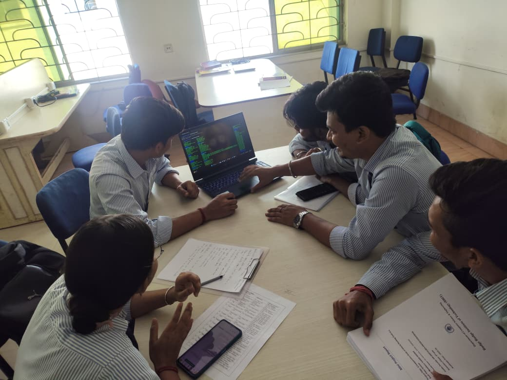
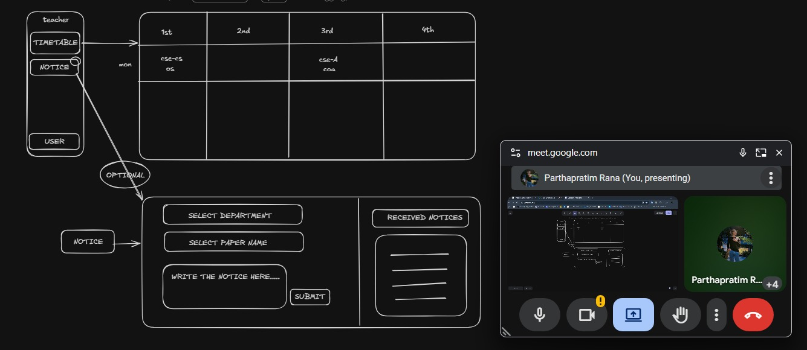

<div align="center">


# 🎓 Timetable Management System

**A full-stack web application designed to automate and streamline university scheduling with role-based dashboards for Admins, Teachers, and Students.**

[📖 Documentation](#-project-overview) • [🚀 Getting Started](#-installation-guide) • [👥 Team](#-team-members) • [📸 Meetings](#-group-meeting-documentation)

---

</div>

## 📌 Project Overview

The **Timetable Management System** automates the process of creating, managing, and monitoring university schedules. It provides a centralized platform that eliminates manual scheduling errors, prevents timetable conflicts, and improves communication across all academic roles.

| Role | Key Capability |
|------|---------------|
| 🛠 **Admin** | Full control over timetables, courses, users & rooms |
| 👨‍🏫 **Teacher** | Post notices, manage schedules, mark attendance |
| 🎓 **Student** | View timetables, receive real-time notifications |

---

## 🎯 Objectives

- ⚡ Automate timetable generation and conflict detection
- 🔒 Prevent scheduling overlaps (teacher/room double-booking)
- 📢 Improve communication between teachers and students
- 🗂 Provide a structured, centralized academic management system

---

## 👥 User Roles & Features

### 🎓 Student Dashboard
- View personal timetable by day/week
- View assigned courses and teachers
- Receive real-time notifications
- Access the notice board
- View attendance records *(optional)*

### 👨‍🏫 Teacher Dashboard
- View full department timetable
- Post academic notices (cancellations, extra classes, assignments)
- Mark student attendance
- Apply for leave
- Notify assigned students in real-time

### 🛠 Admin Dashboard
- Create, edit, and delete timetables
- Manage courses, teachers, and student records
- Assign subjects to rooms and teachers
- Detect and resolve scheduling conflicts automatically
- View all departmental schedules in a unified interface

---

## 🔔 Post Notice Module

Teachers can publish academic notices including:

| Notice Type | Description |
|-------------|-------------|
| 🚫 Class Cancellation | Notify students of a cancelled class |
| ➕ Extra Class | Announce additional sessions |
| 📝 Assignment Deadline | Share task due dates |
| 📋 Exam Update | Communicate exam-related changes |

**Notice Workflow:**

```
Teacher → Submit Notice → Data Validation → Save to Database
    → Notify Students → Update Dashboard → Mark as Read
```

---

## 🏗 System Architecture

The system follows a **3-Tier Architecture**:

```
┌─────────────────────────────────────┐
│     Presentation Layer (Frontend)    │  ← HTML, CSS, JavaScript
├─────────────────────────────────────┤
│     Application Layer (Backend API)  │  ← Python (Django / FastAPI)
├─────────────────────────────────────┤
│     Database Layer (Data Storage)    │  ← MySQL / SQLite
└─────────────────────────────────────┘
```

---

## 🗄 Database Schema

The system uses the following core tables/collections:

| Table | Purpose |
|-------|---------|
| `Users` | Authentication & role management |
| `Students` | Student profile data |
| `Teachers` | Teacher profile & department info |
| `Courses` | Course catalog |
| `Departments` | Faculty & department records |
| `Rooms` | Classroom availability |
| `Timetable` | Schedule entries |
| `Notices` | Posted announcements |
| `Attendance` | Attendance logs |
| `Notifications` | Real-time alert records |

---

## 🛠 Technology Stack

| Layer | Technology |
|-------|-----------|
| **Programming Language** | Python |
| **Backend Framework** | Django / FastAPI |
| **Frontend** | HTML, CSS, JavaScript |
| **Database** | MySQL / SQLite |
| **Authentication** | Django Auth |
| **Version Control** | Git & GitHub |
| **Development Tools** | VS Code |

---

## 📂 Project Structure

```
timetable-management-system/
│
├── 📁 templates/               # HTML templates (Jinja2 / Django templates)
│   ├── admin/                  # Admin dashboard pages
│   ├── teacher/                # Teacher dashboard pages
│   └── student/                # Student dashboard pages
│
├── 📁 static/                  # Frontend assets
│   ├── css/                    # Stylesheets
│   ├── js/                     # JavaScript files
│   └── images/                 # Icons & images
│
├── 📁 timetable/               # Core Django app
│   ├── models.py               # Database models
│   ├── views.py                # Request handlers
│   ├── urls.py                 # URL routing
│   ├── forms.py                # Django forms
│   └── admin.py                # Admin panel config
│
├── 📁 notices/                 # Notice module app
├── 📁 attendance/              # Attendance module app
├── 📁 users/                   # Auth & user management
├── 📁 docs/                    # Documentation & diagrams
│   └── meetings/               # Group meeting screenshots
│
├── manage.py                   # Django management script
├── requirements.txt            # Python dependencies
├── .env.example
└── README.md
```

---

## 🚀 Installation Guide

### Prerequisites
- Python 3.10+
- MySQL or SQLite
- Git
- VS Code (recommended)

### 1. Clone the Repository
```bash
git clone https://github.com/your-username/smart-university-timetable-management-system.git
cd smart-university-timetable-management-system
```

### 2. Create & Activate a Virtual Environment
```bash
python -m venv venv

# On Windows
venv\Scripts\activate

# On macOS/Linux
source venv/bin/activate
```

### 3. Install Dependencies
```bash
pip install -r requirements.txt
```

### 4. Configure Environment Variables
```bash
cp .env.example .env
```

```env
SECRET_KEY=your_django_secret_key
DEBUG=True
DB_NAME=timetable_db
DB_USER=your_mysql_username
DB_PASSWORD=your_mysql_password
DB_HOST=localhost
DB_PORT=3306
```

### 5. Apply Migrations
```bash
python manage.py makemigrations
python manage.py migrate
```

### 6. Create Superuser (Admin)
```bash
python manage.py createsuperuser
```

### 7. Run the Development Server
```bash
python manage.py runserver
```

🌐 The app will be available at `http://127.0.0.1:8000`

---

## 📸 Group Meeting Documentation

> The following screenshots document our team's collaborative meetings, planning sessions, and development progress throughout the project lifecycle.

---

### 📅 Meeting 1 — Project Kickoff & Planning

> *Date: 27 FEB 2026 | Attendees: All Team Members*

<!-- 📎 Add your meeting screenshot below -->


*Caption: Initial project planning session — defining scope, assigning roles, and establishing the project timeline.*

---

### 📅 Meeting 2 — Database & Architecture Design

> *Date: 3 MAR 2026 | Attendees: All Team Members*

<!-- 📎 Add your meeting screenshot below -->


*Caption: Team discussion on system architecture, database schema design, and API structure.*

---

### 📅 Meeting 3 — Development Progress Review

> *Date: [Add Date] | Attendees: All Team Members*

<!-- 📎 Add your meeting screenshot below -->


*Caption: Mid-development review — tracking feature completion, resolving blockers, and integration testing.*

---

### 📅 Meeting 4 — Testing & Final Review

> *Date: [Add Date] | Attendees: All Team Members*

<!-- 📎 Add your meeting screenshot below -->


*Caption: Final testing session — bug fixing, UI polish, and preparing project documentation for submission.*

---
## 👥 Team Members

| Name | Role | Responsibilities |
|------|------|-----------------|
| **Parthapratim Rana** | 🏗 Project Lead / Backend Developer | System architecture, project coordination, backend API development, database schema & integration |
| **Arvind Kumar** |  ⚙️ Backend Developer | REST API endpoints, database models, authentication system, timetable conflict detection |
| **Sumit Kumar** | 🎨 Frontend Developer | Student dashboard UI, timetable view, notification display, responsive design |
| **Priya Ghosh** | 🎨 Frontend Developer | Teacher dashboard, notice board module, attendance marking UI, real-time notifications |
| **Shubham Srivastava** | 🧪 Testing & Documentation | Admin panel development, user & course management, system testing, bug fixing & documentation |

---
## 📌 Future Enhancements

- [ ] 🤖 Automatic AI-Powered Timetable Generator
- [ ] 📱 Mobile Application (React Native)
- [ ] 📧 Email Notification Integration
- [ ] 📷 QR Code Attendance System
- [ ] 📊 Analytics Dashboard for Admin
- [ ] 🌐 Multi-Language Support

---

## 📜 License

This project is licensed under the **MIT License** — see the [LICENSE](LICENSE) file for details.

---

## ⭐ Acknowledgment

This project was developed as part of an academic initiative to modernize university timetable management through automation and structured system design. Special thanks to our faculty advisor and all contributing team members.

---

<div align="center">

**Made with ❤️ by [Your Team Name] | BBIT**

⭐ *If you found this project helpful, please give it a star!* ⭐

</div>